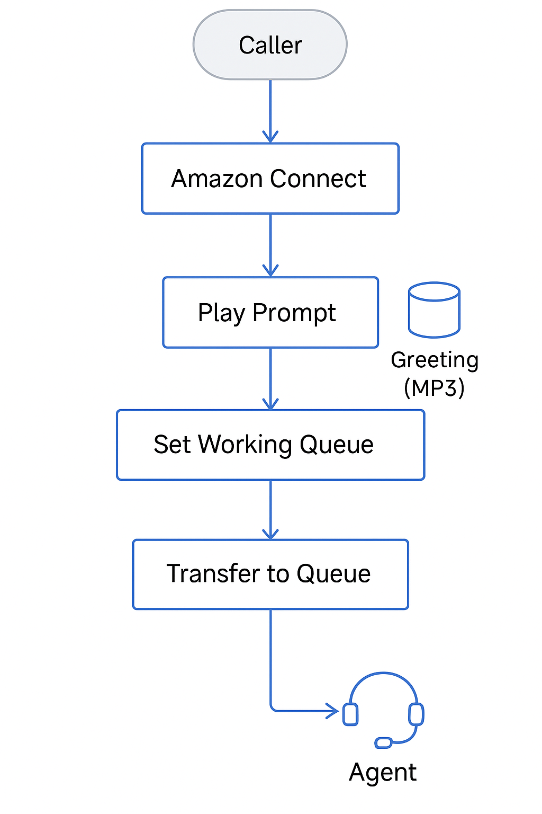

# ☁️ Cloud Contact Center with Amazon Connect

This project demonstrates how to deploy a fully serverless contact center for small businesses using **Amazon Connect** and supporting AWS services.

## 🧩 Features
- Custom call routing via **Amazon Connect contact flows**
- Serverless appointment scheduling using **AWS Lambda + DynamoDB**
- Audio greetings stored in **Amazon S3**
- **Terraform** for Infrastructure as Code
- Secure roles and permissions with **IAM**

## 🛠️ Stack
- Amazon Connect
- AWS Lambda (Python)
- Amazon DynamoDB
- Amazon S3
- IAM Roles & Policies
- Terraform

## 🔧 Use Case
Designed for businesses seeking to implement a low-cost, cloud-native support line without physical infrastructure.

## 📞 Contact Flow Preview
- Call -> Greeting -> Input -> Schedule/Route -> DynamoDB Logging

## 🚀 How to Deploy
1. `terraform init`
2. `terraform apply`
3. Configure Amazon Connect manually to link Lambda & audio prompts.

## 🤝 Contributions Welcome!
